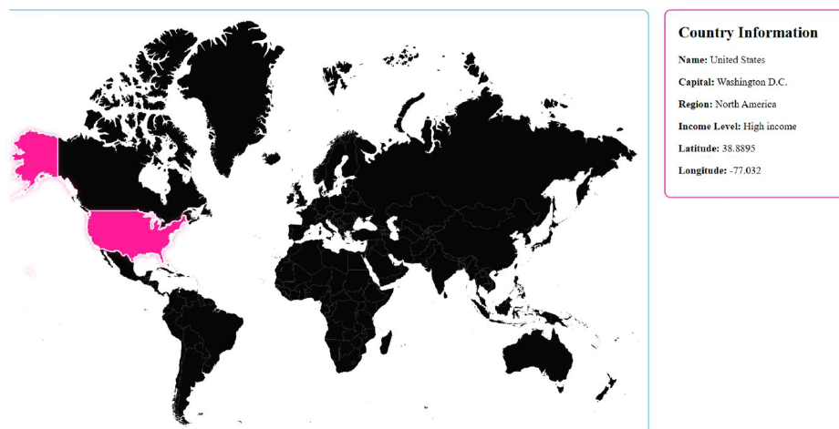

  

<h1 align="center">✦ Interactive World Map ✦</h1>

  <b>Angular & TypeScript Application • World Bank API Integration</b>

An interactive web application that retrieves and displays geographic and economic information for countries selected on an SVG world map.

 

  
  
  
  

 

  

  

  

  

---

## ✦ PROJECT PREVIEW ✦

The selected country is highlighted in pink while its geographic and economic information appears in the country-information panel.

---

## ✦ PROJECT OVERVIEW ✦

The Interactive World Map is an Angular application developed for WGU’s JavaScript Programming course.

The application allows users to select a country on an interactive SVG world map. It then uses the country’s identification code to request information from the World Bank API.

The selected country is visually highlighted, and its information is displayed dynamically without requiring the page to reload.

This project strengthened my understanding of Angular, TypeScript, component-based development, API integration, event handling, and dynamic user-interface updates.

---

## ✦ PROJECT PURPOSE ✦

The goal of this project was to create an interactive single-page application that connects a visual map interface to an external data source.

The application demonstrates how a user’s selection can trigger an API request and transform the returned data into useful information within the interface.

---

## ✦ USER EXPERIENCE ✦

The application follows a straightforward interaction flow:

1. The user selects a country on the world map.
2. The selected country is highlighted.
3. The application identifies the country through its SVG country code.
4. An Angular service sends a request to the World Bank API.
5. The returned information appears in the country-information panel.

This design gives users immediate visual feedback and presents the requested information in one location.

---

## ✦ KEY FEATURES ✦

✦ Interactive SVG world map

✦ Clickable country elements

✦ Visual highlighting for the selected country

✦ Dynamic country-information panel

✦ World Bank API integration

✦ Country lookup using ISO country codes

✦ Angular service for API requests

✦ TypeScript event handling

✦ Component-based application structure

✦ Dynamic interface updates

---

## ✦ COUNTRY INFORMATION ✦

When a country is selected, the application displays:

✦ Country name

✦ Capital city

✦ Geographic region

✦ Income level

✦ Latitude

✦ Longitude

---

## ✦ TECH STACK ✦

  

Angular • TypeScript • HTML • CSS • SVG • REST API • Node.js • npm • Git • GitHub • VS Code

---

## ✦ TECHNICAL IMPLEMENTATION ✦

### Angular Component

The map component manages the selected country, responds to user click events, and updates the information displayed within the interface.

### Angular Service

A dedicated Angular service uses `HttpClient` to retrieve country information from the World Bank API.

### Interactive SVG

The world map consists of SVG paths representing individual countries. Each country contains an identification code used to request the appropriate API data.

### Dynamic Data Display

The application processes the API response and displays the selected country’s information without requiring a page reload.

---

## ✦ SKILLS DEMONSTRATED ✦

✦ Angular Application Development

✦ TypeScript Programming

✦ Component-Based Architecture

✦ REST API Integration

✦ Angular Dependency Injection

✦ Angular Services

✦ Observable Subscriptions

✦ HTTP Requests

✦ Event Handling

✦ SVG Interaction

✦ Dynamic Data Rendering

✦ HTML & CSS Development

✦ Git Version Control

✦ GitHub Project Documentation

---

## ✦ WHAT I LEARNED ✦

✦ How to build an application using Angular and TypeScript

✦ How to organize functionality using components and services

✦ How to connect a front-end application to an external REST API

✦ How to work with asynchronous API responses

✦ How to use country codes to request specific information

✦ How to handle user interactions with SVG elements

✦ How to provide visual feedback for user selections

✦ How to display API data dynamically within an interface

✦ How to document a technical project for a professional portfolio

---

## ✦ FUTURE ENHANCEMENTS ✦

✦ Add country search functionality

✦ Improve keyboard accessibility

✦ Add loading and error messages

✦ Display country flags

✦ Include population and currency information

✦ Add country-name tooltips

✦ Improve the mobile layout

✦ Improve selected-country color contrast

✦ Deploy a public demonstration version

---

## ✦ PROJECT ACCESS ✦

This repository is a public showcase containing project documentation and a screenshot of the completed application.

The complete source code is maintained privately because the application was developed as part of an academic performance assessment.

Course instructions, assessment materials, grading documentation, evaluator information, and complete submission files are not included in this repository.

---

## ✦ SHOWCASE STRUCTURE ✦

    interactive-world-map-showcase/
    ├── assets/
    │   ├── angela-coreas-banner.png
    │   └── world-map-preview.png
    └── README.md

---

## ✦ AUTHOR ✦

**Angela Coreas**

Software Engineering Student • Operations & CRM Professional

**LinkedIn:**  
https://www.linkedin.com/in/angela-coreas-550088186/

**GitHub:**  
https://github.com/angelacoreas1989-boop

**Portfolio:**  
https://angelacoreas1989-boop.github.io/tech-portfolio/

**Email:**  
acorea3@wgu.edu

---

  ✦ Building Solutions • Writing Code • Creating Impact ✦

  <i>💗 Building consistently. Learning intentionally. Creating real-world solutions. 💗</i>

  ✦

